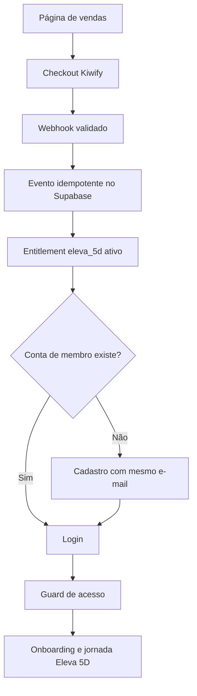

# Eleva 5D — Arquitetura de liberação e acesso V1

> [!success] Aprovação técnica
> Especificação técnica aprovada em 2026-09-04. A implementação do fluxo de checkout, webhook, entitlement e proteção de acesso está autorizada; a publicação do produto ainda não está concluída.

> [!success] Decisão aprovada
> O Eleva 5D será vendido em checkout externo e liberado automaticamente na área de membros por um entitlement registrado no Supabase.

## Decisão

O provedor inicial será a **Kiwify**. A compra acontecerá fora da área de membros; a confirmação será recebida por webhook e processada no backend. O acesso ficará disponível em `membros.kalifranca.com.br/membros/eleva`.

Hotmart será uma alternativa futura por meio de adaptador de provedor, sem duplicar a regra de autorização.

## Jornada canônica

## Princípios de segurança

- `auth.users` representa a conta; `profiles.role` representa a função operacional; `entitlements` representa a compra.
- O frontend não confirma pagamento nem cria acesso.
- O e-mail precisa ser o mesmo e verificado na conta; não haverá vínculo por nome ou telefone.
- Eventos externos serão autenticados, normalizados e processados com idempotência.
- Reembolso, cancelamento e chargeback alteram o status sem apagar histórico.
- Nenhuma credencial, chave privada ou senha será registrada no cofre.

## Estados para a pessoa compradora

- Compra confirmada e acesso pronto.
- Compra confirmada, aguardando cadastro.
- Pagamento em confirmação.
- Compra não localizada para o e-mail informado.
- Acesso suspenso ou revogado.

## Relação com o produto

Depois da liberação, a pessoa inicia o marco “Corte Energético” e acessa o ciclo de cinco movimentos definido no arquivo local `D:\LEONARDO\Kali Franca\aplicativo-eleva-5d\Estrutura Aplicativo - Eleva 5d.md`.

1. Reprogramar
2. Alinhar
3. Manifestar
4. Sustentar
5. Elevar

## Critério de pronto

A liberação será considerada funcional quando uma compra aprovada gerar um único entitlement ativo, a conta correta conseguir acessar `/membros/eleva`, uma conta sem compra for bloqueada e eventos de reembolso/cancelamento revogarem ou suspenderem o acesso sem apagar o histórico.

## Referências

- [[MOC - Kalì Franca]]
- [[Mentoria Frequência da Abundância - Arquitetura aprovada]]
- `docs/superpowers/specs/2026-09-04-eleva-5d-release-access-design.md`
